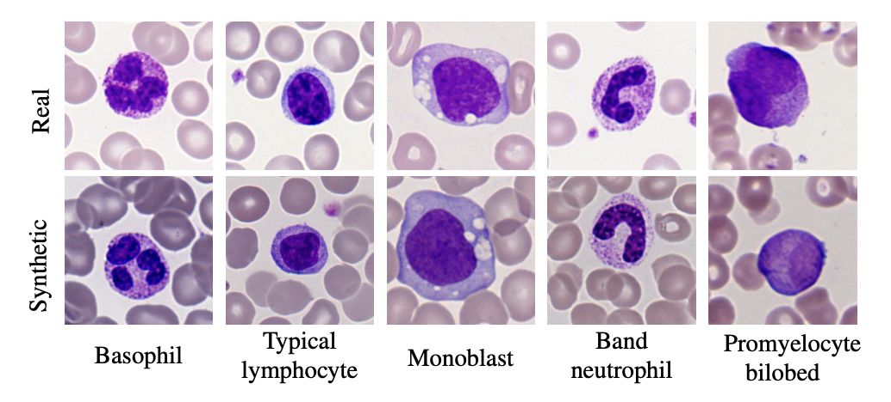

# CytoDiff – AI-Driven Cytomorphology Image Synthesis for Medical Diagnostics

This repository contains the full codebase developed at Helmholtz Munich for the CytoDiff project. The goal is to improve white blood cell image classification by augmenting real-world datasets with high-quality synthetic images generated via diffusion models fine-tuned using LoRA.

---

## 📄 Abstract

Biomedical datasets often contain a large sample imbalance and are subject to strict privacy constraints, which together hinder the development of accurate machine learning models. One potential solution is to generate synthetic images, as this can improve data availability while preserving patient privacy. However, it remains difficult to generate synthetic images of sufficient quality for training robust classifiers.

We demonstrate how synthetic images generated with a fine-tuned stable diffusion model using LoRA weights when guided by real few-shot samples of the target white blood cell classes, can enhance classifier performance for limited data.

When training a ResNet classifier, accuracy increased from 27.3% to 78.4% (+51.1%) by adding 5000 synthetic images per class to a small and highly imbalanced real dataset. For a CLIP-based classifier, the accuracy improved from 61.8% to 76.8% (+15.0%).

The synthetic images are highly similar to real images, and they can help overcome dataset limitations, enhancing model generalization. Our results establish synthetic images as a tool in biomedical research, improving machine learning models, and facilitating medical diagnosis and research.


---

## 🧪 Example: Synthetic White Blood Cell Images

Here are examples of synthetic white blood cell images generated by our pipeline:

<p align="center">
  
</p>

<p align="center">
  <em>Example images generated using a diffusion model fine-tuned on real few-shot samples.</em>
</p>

---

## 🔁 Pipeline Overview

The project follows a three-stage pipeline:

1. **LoRA Training**  
   Fine-tuning Stable Diffusion using class-specific samples.
2. **Image Generation**  
   Producing synthetic cell images using the trained diffusion model.
3. **Image Classification**  
   Evaluating the impact of synthetic data on downstream classification tasks.

Each stage must be completed sequentially.

---

## ⚙️ Setup

Install all required dependencies listed in the `requirements/` directory. It is highly recommended to use a virtual environment (e.g., `venv` or `conda`).

```bash
pip install -r requirements/requirements.txt
```

---


## 📂 Repository Structure

```
---
CytoDiff/
├── classification/          # Classifier training and evaluation
├── generation/              # Synthetic image generation
├── training/                # LoRA fine-tuning for Stable Diffusion
├── requirements/            # Python dependencies

```

---


## 📜 License

This repository is intended for academic and research purposes only.  
If you have any questions or need further information, feel free to contact me at **jancarreras24@gmail.com**.

---


## Code Acknowledgement

This project uses code and resources adapted from the [DataDream repository](https://github.com/ExplainableML/DataDream).  
We thank the authors for making their work publicly available and for their valuable contributions to the field.

